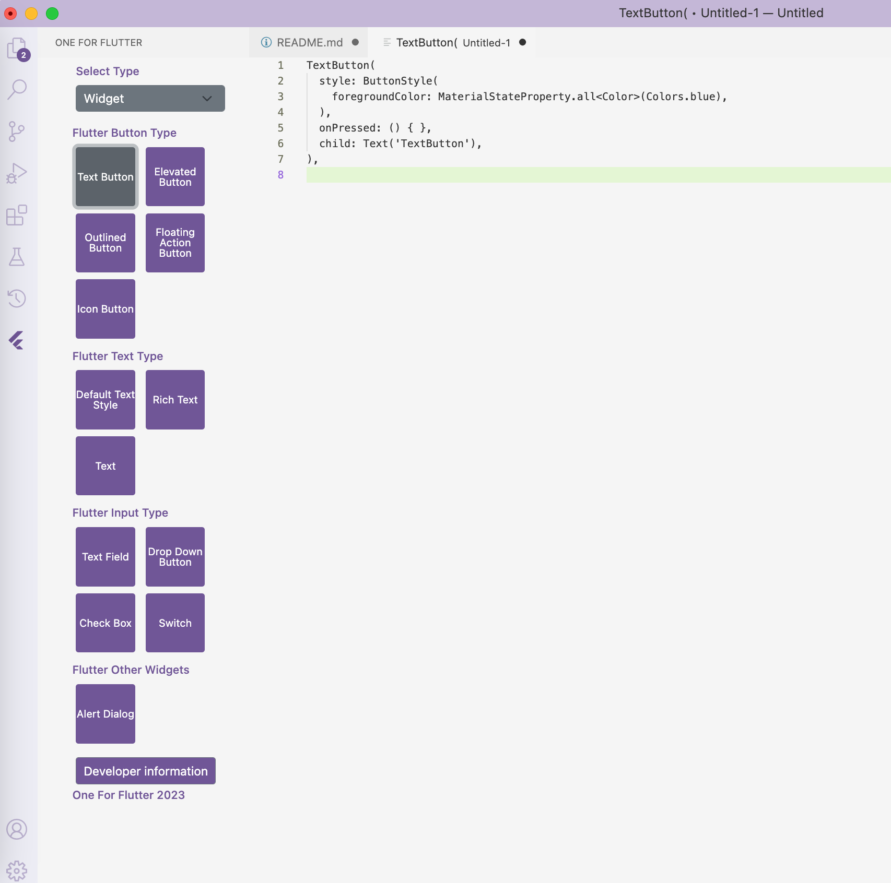

# One For Flutter README

ReadMe for the One For Flutter extension.

Please file any issues you encounter in [that repository](https://github.com/EminTalhaArik/one-for-flutter).

## Features

## Plugin Images

**Widget Section**

**Dart Section**

**Layout Section**

Click on the One For Flutter icon from the side menu to open the panel.
Select Widget, Layout, or Dart from the select box and insert your code into the editor.

### For more information

- [One For Flutter Support](https://github.com/EminTalhaArik/one-for-flutter)

**Enjoy!**
